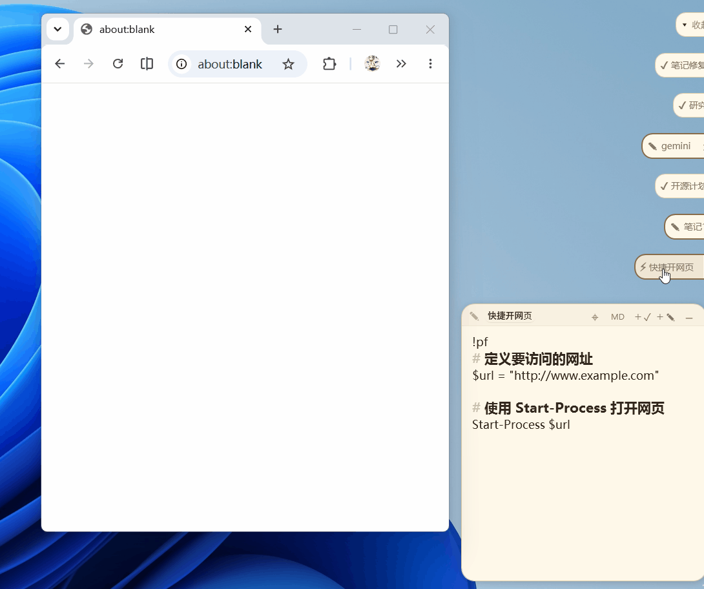
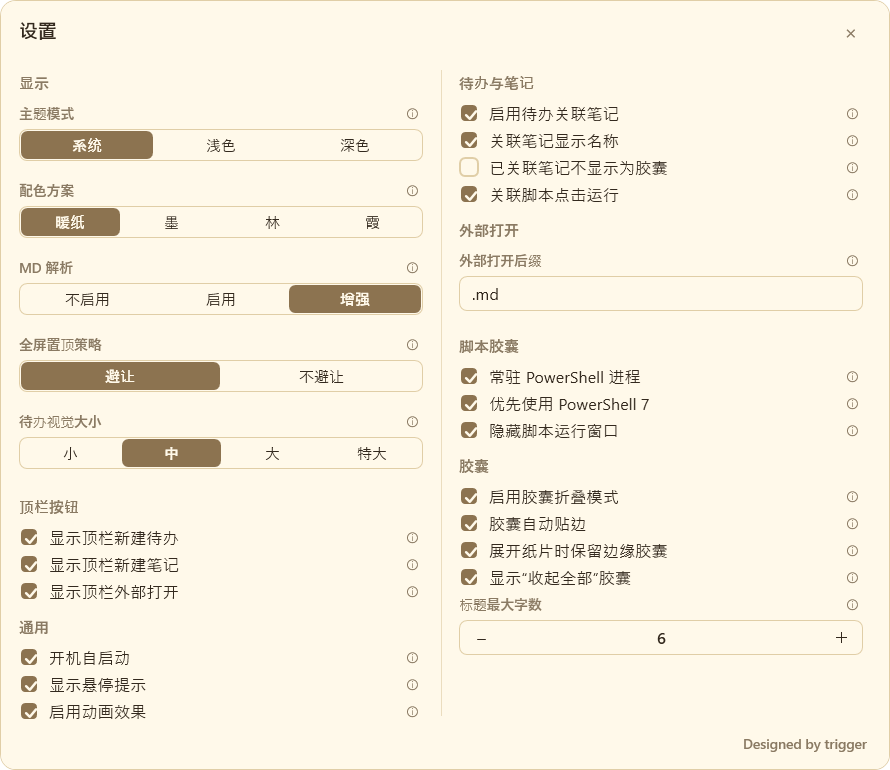

# PaperTodo User Manual

**Language: English | [简体中文](USER_GUIDE.md)**

> **Related Links**: [Back to Home](../README.md) · [Plugin Development Manual](../plugin-samples/README.md) · [Changelog](../CHANGELOG.md)
>
> This manual covers **4.0.0-beta1**. Older versions may not include every feature described here. Screenshots illustrate basic operations; use the current version's settings layout.

This document is for everyday users of PaperTodo. Start with [1. Quick Start](#1-quick-start), then use the contents to find individual features.

---

## Table of Contents

- [1. Quick Start](#1-quick-start)
  - [1.1 Installation & Edition Choice](#11-installation--edition-choice)
  - [1.2 First Launch & Philosophy](#12-first-launch--philosophy)
  - [1.3 3-Minute Quick Start](#13-3-minute-quick-start)
- [2. General Paper Operations](#2-general-paper-operations)
  - [2.1 Paper States: Expanded & Capsule](#21-paper-states-expanded--capsule)
  - [2.2 Top Bar Controls & Actions](#22-top-bar-controls--actions)
  - [2.3 Moving, Resizing & Windows Snap](#23-moving-resizing--windows-snap)
  - [2.4 Concept Breakdown: Collapse, Hide, Delete, Exit](#24-concept-breakdown-collapse-hide-delete-exit)
  - [2.5 Full-Text Search](#25-full-text-search)
- [3. Todo Paper Complete Guide](#3-todo-paper-complete-guide)
  - [3.1 Adding & Editing Items](#31-adding--editing-items)
  - [3.2 Ordering, Deletion & Batch Actions](#32-ordering-deletion--batch-actions)
  - [3.3 Completed Items Workflow](#33-completed-items-workflow)
  - [3.4 Quick Launch: Linking Papers & Local Files](#34-quick-launch-linking-papers--local-files)
  - [3.5 Scheduled Countdown Reminders](#35-scheduled-countdown-reminders)
- [4. Note Paper Complete Guide](#4-note-paper-complete-guide)
  - [4.1 Edit Mode & Reading Mode](#41-edit-mode--reading-mode)
  - [4.2 Supported Markdown Syntax](#42-supported-markdown-syntax)
  - [4.3 Local Image Insertion & LMDB Storage](#43-local-image-insertion--lmdb-storage)
  - [4.4 Opening in External Editors](#44-opening-in-external-editors)
- [5. Edge Capsules & Live Preview Cards (Edge Preview)](#5-edge-capsules--live-preview-cards-edge-preview)
  - [5.1 Edge Docking & Auto Snapping](#51-edge-docking--auto-snapping)
  - [5.2 Interactive Hover Preview Cards](#52-interactive-hover-preview-cards)
  - [5.3 Multi-Monitor Queues & Reordering](#53-multi-monitor-queues--reordering)
  - [5.4 Master Capsule (Queue Controller)](#54-master-capsule-queue-controller)
- [6. Advanced Playbook: Script Capsules (PowerShell)](#6-advanced-playbook-script-capsules-powershell)
  - [6.1 Script Capsule Declaration Syntax](#61-script-capsule-declaration-syntax)
  - [6.2 Triggering & Persistent Processes](#62-triggering--persistent-processes)
  - [6.3 Security Guidelines](#63-security-guidelines)
- [7. Comprehensive Keyboard Shortcuts](#7-comprehensive-keyboard-shortcuts)
  - [7.1 Built-in Paper Hotkeys](#71-built-in-paper-hotkeys)
  - [7.2 Global System Hotkeys](#72-global-system-hotkeys)
  - [7.3 Edge Capsule Quick Access (1~9)](#73-edge-capsule-quick-access-19)
- [8. Settings Panoramic Walkthrough](#8-settings-panoramic-walkthrough)
  - [8.1 General Behaviors](#81-general-behaviors)
  - [8.2 Visual Styling (Backgrounds & Fonts)](#82-visual-styling-backgrounds--fonts)
  - [8.3 Hotkey Configuration](#83-hotkey-configuration)
  - [8.4 Plugin System Guide (Protocol 2.1)](#84-plugin-system-guide-protocol-21)
  - [8.5 Experimental Labs Features (4.0 Advanced)](#85-experimental-labs-features-40-advanced)
- [9. Tray Menu & Command-Line Interface (CLI)](#9-tray-menu--command-line-interface-cli)
  - [9.1 System Tray Menu](#91-system-tray-menu)
  - [9.2 CLI Launch Arguments](#92-cli-launch-arguments)
- [10. Data Backup, Migration & Recovery](#10-data-backup-migration--recovery)
  - [10.1 Directory Structure & Files](#101-directory-structure--files)
  - [10.2 Standard Backup Procedure](#102-standard-backup-procedure)
  - [10.3 Moving to a New PC & Disaster Recovery](#103-moving-to-a-new-pc--disaster-recovery)
- [11. Frequently Asked Questions (FAQ)](#11-frequently-asked-questions-faq)

---

## 1. Quick Start

### 1.1 Installation & Edition Choice

PaperTodo is a portable single-executable application with no installer. Choose a version on the [Releases page](https://github.com/snownico0722/PaperTodo/releases), then download its Windows x64 executable. To use the 4.0 features in this manual, choose the matching 4.0 prerelease rather than an older stable release.

| Edition Identifier | Characteristics | Recommended Audience |
| :--- | :--- | :--- |
| `self-contained.exe` | Includes the .NET runtime | **Recommended for most users**; no separate runtime installation |
| `no-runtime.exe` | Excludes the runtime; the compressed 4.0 single-file package is about 17 MiB, with the download page showing its exact size | Systems with **.NET 10 Desktop Runtime (x64)** installed |

> [!IMPORTANT]
> Create a dedicated folder, such as `D:\Apps\PaperTodo\`, and run `PaperTodo.exe` from there.
> **Do not** run from a temporary extraction directory or a read-only folder; data and images might not be saved. Exit from the tray before updating the executable, and keep the existing data files.

### 1.2 First Launch & Philosophy

When you start `PaperTodo.exe`:
- A default Todo paper appears in the center of the desktop;
- The PaperTodo icon appears in the Windows notification area (system tray).

**PaperTodo has no central management window.** Each paper is its own interface, and the tray is the global entry point. **Double-click the tray icon** to bring papers back when they are covered or off-screen.

Version 4.0 supports up to **200 papers**. Collapsing or hiding a paper preserves it and does not free a slot; delete papers you no longer need.

### 1.3 3-Minute Quick Start

1. **Enter a Todo**: Type in the blank row and press <kbd>Enter</kbd> to continue with another item below.
2. **Mark Complete**: Check the box on the left; the text receives a strike-through.
3. **Reposition Paper**: Drag the blank top-bar area; click the pin to toggle always-on-top.
4. **Collapse to Capsule**: Click the top-right button. With capsule mode and edge docking enabled, the paper folds into the screen edge.
5. **Preview or Open**: With live edge previews enabled, hover to browse content; click the capsule to open the full paper.

Edits save automatically. To find content on another paper, press <kbd>Ctrl</kbd> + <kbd>F</kbd>; see [Full-Text Search](#25-full-text-search).

---

## 2. General Paper Operations

<div align="center">
  
</div>

### 2.1 Paper States: Expanded & Capsule

A paper has two forms:
- **Expanded**: A normal sticky-note window for reading, editing, checking tasks, and viewing images.
- **Capsule**: A small folded pill floating on the desktop or docked along a screen edge.

Click the top-right collapse button, press <kbd>Ctrl</kbd> + <kbd>W</kbd>, or **middle-click the blank top-bar area** to close the active expanded paper. With capsule mode disabled, these actions hide the paper instead of deleting its content.

### 2.2 Top Bar Controls & Actions

| Control / Area | Action | Description |
| :--- | :--- | :--- |
| **Pin Icon** | Click | Toggle always-on-top; fullscreen avoidance follows your settings |
| **Title Text** | Click | Edit the title; <kbd>Enter</kbd> commits and <kbd>Esc</kbd> cancels |
| **Link Icon** | Drag | Link this paper to a target todo item |
| **Window Tether Handle** | Drag | Attach to a third-party window after enabling the corresponding Labs feature |
| **New Todo / Note** | Click | Create another paper beside the current one |
| **MD Export Button** | Click | Notes only: export temporarily and open with the associated application |
| **Collapse / Hide** | Click | Collapse into a capsule, or hide when capsule mode is disabled |

> [!TIP]
> Narrow papers hide some secondary buttons. Plugins can also add top-bar actions, such as the Codex CLI Bridge's `>_`; see [Plugin System Guide](#84-plugin-system-guide-protocol-21).

### 2.3 Moving, Resizing & Windows Snap

- **Move**: Drag an empty area of the top bar.
- **Resize**: Drag the bottom-right dotted grip. Set the grip to Hidden in "Settings → Visual" to resize from any border or corner instead.
- **Windows Snap**: Drag an expanded paper to a screen edge to use Windows Snap. The outer shadow disappears while snapped and returns when unsnapped.

### 2.4 Concept Breakdown: Collapse, Hide, Delete, Exit

| Action | Where It Goes | Data Retention | How to Restore |
| :--- | :--- | :--- | :--- |
| **Collapse** | Edge capsule or floating pill | Preserved | Click the capsule |
| **Hide** | Leaves the desktop and capsule queue; the app stays running | Preserved | Show it from the tray list or double-click the tray |
| **Delete** | Removes the paper | Content deleted | Requires confirmation; do not use as a substitute for hiding |
| **Exit** | Saves data and closes PaperTodo | Preserved on disk | Run `PaperTodo.exe` again |

### 2.5 Full-Text Search

Press <kbd>Ctrl</kbd> + <kbd>F</kbd> in a Todo or Note paper and enter the text to find.

- Search covers all todos and notes, with separate **current-paper** and **global** match counts.
- Press <kbd>Enter</kbd> for the next match or <kbd>Shift</kbd> + <kbd>Enter</kbd> for the previous one, or use the search bar's navigation buttons.
- Matches on other papers are located and highlighted automatically. A matching paper opens when it is currently collapsed into a capsule.
- Drag the search bar out of the way when it covers content. Close it when you have finished searching.

---

## 3. Todo Paper Complete Guide

Todo papers are for everyday checklists, plans, and small tasks.

### 3.1 Adding & Editing Items

- **New Item**: Type in the bottom blank row; press <kbd>Enter</kbd> to insert an item below.
- **Edit and Select**: Click text to edit; double-click to select the item's text for copying or replacement.
- **Move Between Items**: Use <kbd>↑</kbd> / <kbd>↓</kbd> at an editing boundary to continue into an adjacent item. Holding the key does not race across multiple items.
- **Delete a Blank Row**: Press <kbd>Backspace</kbd> in an unmarked empty row.
- **Multi-Line Paste**: Pasted lines become separate items, handling list bullets, numbering, and Markdown task markers. A notice appears when count or text limits are exceeded; do not assume rejected text was saved.
- **Undo and Redo**: <kbd>Ctrl</kbd> + <kbd>Z</kbd> undoes, and <kbd>Ctrl</kbd> + <kbd>Y</kbd> redoes. One multi-line paste can be undone as one operation.

### 3.2 Ordering, Deletion & Batch Actions

- **Reorder or Delete**: Drag the right-side handle (`≡`) vertically to reorder, or into the bottom trash area to delete.
- **Swipe to Multi-Select**: Hold the left mouse button and drag along the left side of the items to select consecutive rows.
- **Batch Actions**: Check / uncheck, copy, delete from the context menu, or drag the selected group into the trash.
- **Copy Completion States**: <kbd>Ctrl</kbd> + <kbd>Shift</kbd> + <kbd>C</kbd> copies selected items as Markdown tasks, such as `- [ ] Unfinished` and `- [x] Finished`. Use <kbd>Ctrl</kbd> + <kbd>C</kbd> for ordinary copying.

### 3.3 Completed Items Workflow

Choose how completed items behave in "Settings → Todo":
- **Auto-Clear Completed Items**: Remove an item after checking it; undo to recover an accidental removal.
- **Auto-Sink Completed Items**: Move checked items to the completed area at the bottom; unchecked items return to the unfinished area.

Auto-sink is unavailable while auto-clear is enabled.

### 3.4 Quick Launch: Linking Papers & Local Files

A todo can also be a shortcut to a paper, file, or folder. Related options are in "Settings → Todo".

#### Link to Another Paper
1. Open the paper you want to link.
2. Drag its top-bar **link icon** onto a todo item and release when the target highlights.
3. Click the new paper icon on the todo's right side to open the linked paper.

#### Link to External Files or Folders
1. Select a file or folder in Windows File Explorer.
2. Drag it onto the target todo row.
3. Click the right-side action to open it with the default application. Right-click the item to open its containing folder or remove the link.

### 3.5 Scheduled Countdown Reminders

Enable **Todo reminders** in "Settings → Todo", then right-click an item to set a reminder.
- **Presets**: Choose a minute / hour interval, this evening, tomorrow morning, or another available preset.
- **Custom Duration**: Enter the countdown duration you need.
- **Due Notification**: PaperTodo locates and highlights the item and sends a tray notification. Enable reminder sound and choose a sound in Settings when you need an audible alert.

Reminders depend on PaperTodo running. Closing a paper is not the same as exiting the application.

---

## 4. Note Paper Complete Guide

<div align="center">
  
</div>

Note papers are for lightweight writing, ideas, and illustrated reminders.

### 4.1 Edit Mode & Reading Mode

Choose a rendering level in "Settings → Note → Markdown":

| Level | Behavior |
| :--- | :--- |
| **Off** | View and edit Markdown mainly as plain source text |
| **Basic** | Keep source markers with basic styling; reading mode fades syntax and displays bullets and dividers |
| **Full Render** | Render headings, lists, quotes, code blocks, images, and inline styles directly, **including while editing** |

- **Edit**: Click the body to place the caret. Full Render does not turn the entire note into plain source; relevant markers appear as you edit them so you can adjust the syntax.
- **Read**: Click outside the paper. The note displays using the selected rendering level.
- **Open Links**: Click directly while reading; hold <kbd>Ctrl</kbd> and click while editing.
- **Zoom Text**: Use <kbd>Ctrl</kbd> + mouse wheel; click the percentage badge to reset to 100%.
- **Copy Plain Text**: Select text and press <kbd>Ctrl</kbd> + <kbd>Shift</kbd> + <kbd>C</kbd>.

#### Click Markdown Task Checkboxes

Write a task list in the note:

```markdown
- [ ] Organize references
- [x] Send email
```

Select **Full Render**, then click a rendered checkbox to mark the task complete or incomplete without editing `[ ]` / `[x]` manually. This works in both editing and reading modes. If the marker is showing as source, move the caret away so the checkbox reappears. Checking updates the note's content and supports undo.

> [!NOTE]
> Notes still have an input-protection limit. A notice appears when you reach it. Split very long content into multiple papers rather than repeatedly pasting past a warning.

### 4.2 Supported Markdown Syntax

| Syntax | Example | Result |
| :--- | :--- | :--- |
| **Headings** | `# Heading 1` / `## Heading 2` / `### Heading 3` | Heading levels |
| **Bold** | `**Bold text**` | **Bold text** |
| **Italic** | `*Italic text*` | *Italic text* |
| **Bold-Italic** | `***Important***` or `___Important___` | ***Important*** |
| **Strikethrough** | `~~Outdated~~` | ~~Outdated~~ |
| **Unordered List** | `- First item` or `* First item` | Bulleted list |
| **Ordered List** | `1. First step`, `2. Second step` | Numbered list |
| **Task List** | `- [ ] Unfinished` / `- [x] Finished` | Clickable checkboxes in Full Render |
| **Blockquote** | `> Quoted text` | Quoted paragraph |
| **Inline Code** | `` `console.log()` `` | Monospaced code |
| **Code Block** | <code>```<br>code<br>```</code> | Separate code block |
| **Hyperlink** | `[Label](https://example.com)` | Clickable link |
| **Horizontal Rule** | `---` or `***` | Divider |
| **Backslash Escape** | `\*Not italic\*` | Literal asterisks |

Bold, italic, strikethrough, and links can be combined. Version 4.0 uses consistent parsing for headings, quotes, lists, code fences, basic HTML, escapes, and images inside code, improving display and editing of nested content.

> [!NOTE]
> PaperTodo remains lightweight: it does not provide complex tables, remote-hosted images, embedded attachments, or full block-level HTML layout. Use an external editor for more complex formatting.

### 4.3 Local Image Insertion & LMDB Storage

- Press <kbd>Ctrl</kbd> + <kbd>V</kbd> after copying an image or taking a screenshot.
- Drag one or more image files from File Explorer.
- Right-click the note body and choose "Insert Image".

Images are referenced as `` in the text, with the actual data in `note-assets.lmdb` beside the executable. Right-click a rendered image to copy it or remove its reference. Keep the image database together with the text data when migrating.

### 4.4 Opening in External Editors

Click `MD` in the top bar to export the note and its referenced images temporarily, then open it with the associated application. "Settings → Note" lets you change the file extension used for external opening.

> [!WARNING]
> External opening is a one-way export. Changes saved in another editor **do not** sync back automatically; copy them into PaperTodo manually.

---

## 5. Edge Capsules & Live Preview Cards (Edge Preview)

<div align="center">
  
</div>

### 5.1 Edge Docking & Auto Snapping

Enable capsule mode and edge docking in "Settings → General" to collapse papers to the left or right screen edge. Click an edge capsule to open its full paper.

- **Repeated Click**: With the corresponding option enabled and an edge slot retained for the expanded paper, another click retracts a clearly visible paper. A substantially covered paper is brought to the front instead.
- **Title Length**: Advanced settings can limit edge-capsule title length, **hide it entirely**, or leave it **unlimited**.
- **Sliding Title Reveal**: With live edge previews disabled, hover over a shortened title to slide it out to its full length; moving away retracts it. This reveals the title, not just the trailing close-button area.
- **Close Button**: Hiding the close button also removes its empty space.

### 5.2 Interactive Hover Preview Cards

With live edge previews enabled, hover over a docked capsule to browse a card without opening the full paper.

- **Todo Preview**: Browse a simplified scrollable list, check / uncheck tasks, and use dedicated linked-paper or file action targets. Click the card background to open the full paper.
- **Note Preview**: Follows the note's Markdown rendering and previews up to **6000 characters**. Open the full paper for longer content; the preview limit does not truncate the original note.
- **Continuous Browsing**: Move between adjacent capsules to switch cards. Adjustable pointer-intent prediction reduces accidental switches. Leaving the browse area retracts the card.
- **Downward Expansion**: "Settings → General → Prefer downward expansion while browsing" is on by default. When there is enough space below, the card stays near the pointer instead of jumping upward to fill a gap. Turn it off to prioritize the upper space released by the previous card.
- **Dragging**: Previews retract when a capsule drag begins, leaving reordering and edge-switching gestures unobstructed.

### 5.3 Multi-Monitor Queues & Reordering

- **Switch Edges**: Drag a capsule to the opposite screen edge or another monitor's edge.
- **Reorder**: Drag capsules up or down within a queue.
- **Remember Expanded Position**: Enable this option to remember a full paper's position on a different monitor from its capsule. Different monitor scaling levels are supported.

### 5.4 Master Capsule (Queue Controller)

The **Master Capsule shows only a count** at the top of the queue:
- Click it to collapse or expand that side's capsule entries, not delete papers.
- Drag it vertically to adjust the whole queue's starting position.
- Right-click it to open the global menu.

"Settings → General" also lets you disable forced always-on-top for docked and master capsules.

---

## 6. Advanced Playbook: Script Capsules (PowerShell)

<div align="center">
  
</div>

A Note paper can be a convenient PowerShell script launcher.

### 6.1 Script Capsule Declaration Syntax

Put a directive on the note's **first line**, followed by the script:

```powershell
!p
Get-Service | Where-Object Status -eq 'Running' | Select-Object -First 5
```

| Directive | Behavior |
| :--- | :--- |
| `!p` or `!power` | Automatically choose PowerShell and report execution errors |
| `!pwsh` or `!ps7` | Use an installed PowerShell 7 |
| `!ps5` or `!winps` | Use Windows PowerShell 5.1 |
| `!pf` or `!powerf` | Reuse a session and retain variables when persistent processes are enabled |

### 6.2 Triggering & Persistent Processes

- Collapsing the note displays a **lightning icon**. Left-clicking runs the script instead of opening the paper.
- To edit the script, right-click the capsule and choose "Expand Paper".
- Persistent processes, PowerShell 7 preference, and hidden execution windows are configured in "Settings → Note" with Advanced Mode enabled.

### 6.3 Security Guidelines

> [!CAUTION]
> Scripts run with the permissions of the PaperTodo process. Do not run unknown or unchecked scripts.

---

## 7. Comprehensive Keyboard Shortcuts

### 7.1 Built-in Paper Hotkeys

| Shortcut | Scope | Action |
| :--- | :--- | :--- |
| <kbd>Ctrl</kbd> + <kbd>F</kbd> | Todo / Note | Open full-text search |
| <kbd>Enter</kbd> / <kbd>Shift</kbd> + <kbd>Enter</kbd> | Search bar | Next / previous match |
| <kbd>Ctrl</kbd> + <kbd>W</kbd> | General | Close the active paper; hide it when capsule mode is off |
| <kbd>Esc</kbd> | General | Cancel an active edit, selection, or drag; close the paper when idle |
| <kbd>Ctrl</kbd> + <kbd>Z</kbd> / <kbd>Y</kbd> | Todo / Note | Undo / redo |
| <kbd>Ctrl</kbd> + <kbd>Shift</kbd> + <kbd>C</kbd> | Selected todos | Copy Markdown tasks with completion states |
| <kbd>Ctrl</kbd> + <kbd>Shift</kbd> + <kbd>C</kbd> | Selected note text | Copy plain text |
| <kbd>↑</kbd> / <kbd>↓</kbd> | Todo editing | Move to the adjacent item at an editing boundary |
| <kbd>Ctrl</kbd> + <kbd>B</kbd> / <kbd>I</kbd> / <kbd>K</kbd> | Note | Bold / italic / insert link |
| <kbd>Ctrl</kbd> + mouse wheel | Note | Zoom text; click the percentage to reset |

Plugins may provide their own hotkeys or handle <kbd>Esc</kbd> within their body. Follow the plugin's instructions.

### 7.2 Global System Hotkeys

Record combinations in "Settings → Hotkeys" to use these actions while another application has focus:
- Show All / Hide All / Toggle Visibility, New Todo / Note, and Exit.
- Lock all papers.
- Toggle opacity for all papers or the active paper, or for all capsules.
- Send papers or capsules behind other windows.

Some actions correspond to Labs features that must first be enabled. Combine modifiers such as <kbd>Ctrl</kbd>, <kbd>Alt</kbd>, <kbd>Shift</kbd>, or <kbd>Win</kbd> with a regular key. Choose another combination if the system reports it is already in use.

### 7.3 Edge Capsule Quick Access (1~9)

Enable side-capsule quick access to open papers by their queue numbers. Defaults are <kbd>Ctrl</kbd> + <kbd>Shift</kbd> + <kbd>1~9</kbd> on the left and <kbd>Ctrl</kbd> + <kbd>Alt</kbd> + <kbd>1~9</kbd> on the right. You can choose whether number-row and numpad digits are distinguished.

---

## 8. Settings Panoramic Walkthrough

Right-click the tray and choose "Settings". Version 4.0 uses **left-side navigation** for General, Todo, Note, Visual, Hotkeys, and Plugins. Advanced Mode reveals additional options and the Labs page.

The window adapts to the active work area, display scaling, and monitor changes. Toggles and hotkey recording refresh locally where possible. Use the explanation icons for details.

<div align="center">
  
</div>

### 8.1 General Behaviors

- **General**: Startup, tooltips, animation, language, top-bar buttons, and capsule behavior. Advanced Mode adds taskbar / Alt+Tab visibility and fullscreen avoidance. Restart after changing the language.
- **Todo**: Auto-clear / auto-sink completed items, paper and file links, reminders, and reminder sounds.
- **Note**: Three Markdown rendering levels, Full Render editing animation, and external-opening extension. Advanced Mode adds large-image compression and script-capsule settings.

See [4.1](#41-edit-mode--reading-mode) for rendering behavior. Basic retains source markers; choose Full Render to keep the final layout while editing and click task checkboxes directly.

### 8.2 Visual Styling (Backgrounds & Fonts)

- **Themes and Palettes**: Follow System, Light, Dark; Warm Paper, Ink, Forest, and Rosy palettes.
- **Resize Grip**: Standard, Soft, or Hidden; Hidden enables direct border resizing.
- **Typography**: System Default, Microsoft YaHei, DengXian; Standard / Soft / Crisp text rendering.

#### Custom Paper Backgrounds

1. Name an image `papertodo.png`, `papertodo.jpg`, or `papertodo.jpeg` and place it **beside `PaperTodo.exe`**, not in `assets/` or `plugins/`.
2. Restart and open "Settings → Visual → Paper background". This section appears after an image is detected.
3. **Blend with paper colors**: Off shows the original image; on blends it with the current paper colors. This is **not an image visibility switch**.
4. Choose Stretch, Center, Bottom Left, Bottom Center, or Bottom Right under Position. Stretch fills the area; the other options scale proportionally and align the image at the chosen position.

The same image is used for **notes and todos**. After replacing it, toggle blending, change position, or restart to refresh. To remove the background, move or rename the candidate images and restart. When several candidates exist, PNG is preferred, then JPG, then JPEG.

Decoding caps the longest edge at **4096 pixels** without modifying the original file. Blending and position preferences are stored separately in `%LOCALAPPDATA%\PaperTodo\paper-background.json`; see [Backup Procedure](#102-standard-backup-procedure).

#### Custom Font Installation

1. Prepare a `.ttf` or `.otf` font.
2. Rename it to `papertodo.ttf` or `papertodo.otf` and place it beside the executable.
3. Optionally add a matching bold font as `papertodo_bold.ttf`.
4. Exit from the tray and restart to load the font.

### 8.3 Hotkey Configuration

Click an action's recording field and press a combination. The interface checks for conflicts. "Restore defaults for this page" also resets the option to distinguish numpad digits. Configure plugin-provided hotkeys according to the plugin's instructions.

### 8.4 Plugin System Guide (Protocol 2.1)

Plugins can turn notes into clocks, Pomodoro timers, or review panels, and add todo actions, top-bar buttons, menus, hotkeys, and dedicated capsule / Mini previews. Plugins must be compatible with **protocol 2.1**.

- **Web Plugins**: HTML/CSS/JavaScript running through WebView2.
- **Native Plugins**: Compiled .NET 10 + WPF plugins.
- **Plugin Data**: Host-managed data is stored in `plugins/data/`, with configuration in "Settings → Plugins". Separate storage does not mean permission isolation.

#### Installation Steps

1. Obtain a complete, runnable plugin folder. The repository's [`plugins/`](../plugins/) contains built plugins; [`plugin-samples/`](../plugin-samples/) contains source and development documentation. **Native source folders cannot be copied as a substitute for compiled plugins.** The main application release does not bundle these plugins.
2. Exit PaperTodo from the tray.
3. Place the complete folder at `plugins/<plugin-id>/` beside the executable. Its folder name must match `id` in `plugin.json`, and the manifest must be directly inside it, not nested one extra level down.
4. Restart and verify detection in "Settings → Plugins".
5. For plugins that provide a body, right-click a Note paper and select the plugin under "Body Type". Some plugins create an entry paper automatically according to their settings.

Restart after updating or removing plugin files too. Replacing a Native DLL does not hot-reload it.

> [!WARNING]
> PaperTodo **does not provide a security sandbox for plugins**. Treat both Native and Web plugins as trusted code and install only from trusted sources. The data directory does not restrict a plugin's access to the system.
>
> Developers can use the [Plugin Development Manual](../plugin-samples/README.md).

#### Sample Plugins and Codex CLI Bridge

Runnable examples include a native clock, Pomodoro timer, review pool, Web clock, and **Codex CLI Bridge**. Select the plugins you need from the built directory; you do not need to install every example.

Codex CLI Bridge requires Codex CLI to be installed and signed in on this computer:
- The **`>_`** action beside a todo sends that item together with linked papers, file paths, or supported images to local Codex for background execution.
- The top-bar **`>_`** sends the current Todo / Note paper's full content and opens a window for viewing the result.
- The automatically created **Codex CLI paper** edits the default prompt. Plugin settings control the model, reasoning, command path, and default working directory.
- Deleting the last paper for this plugin also removes its global buttons. Collapse its entry paper instead when you only want it out of the way.

It uses your local Codex login, approval, and sandbox configuration; it is not a free AI service bundled with PaperTodo. See the [Codex CLI Bridge notes](../plugin-samples/PaperTodo.Plugin.CodexCliBridge/README.md) for more options.

### 8.5 Experimental Labs Features (4.0 Advanced)

Enable Advanced Mode, then select the Labs capabilities you need:

- **Local MCP**: Enable the feature and permissions, copy the client configuration and AI Skill prompt, and use them in an MCP-compatible client. The client starts `PaperTodo.exe --mcp` to read, create, append, or manage notes and todos as authorized.
- **External Window Tethering**: Drag the top-bar tether handle onto another application's window to follow its movement, minimization, and restoration.
- **Magnetic Edge Capsules**: Floating capsules snap near screen or external-window edges, slide out on hover, and retract when the pointer leaves. This is a different option from the fixed left / right edge queues.
- **Focus-Loss Automation**: Fade a paper, hide its title icons / title bar, or collapse it when focus is lost.
- **Resting Translucency**: Set separate idle opacity for normal and docked capsules.
- **Send Behind and Click-Through**: Use global hotkeys to place papers or capsules below other windows. With click-through enabled, they no longer intercept mouse input.

MCP gives an external client access to your content; grant trusted clients only the access they need. MCP and Codex CLI Bridge are separate entry points, and neither requires installing the other.

---

## 9. Tray Menu & Command-Line Interface (CLI)

### 9.1 System Tray Menu

Right-click the PaperTodo icon in the Windows notification area:
- The top of the menu shows the version.
- Show / hide all papers, or create a Todo / Note paper.
- The paper list shows titles and states. Click to locate a paper; use its `×` action to confirm deletion.
- Settings opens configuration; Exit saves and closes the application.

### 9.2 CLI Launch Arguments

Use these commands in shortcuts, batch files, or launchers:

| Command | Alias | Action |
| :--- | :--- | :--- |
| `PaperTodo.exe --show` | `PaperTodo.exe open` | Show and recall all papers |
| `PaperTodo.exe --hide` | None | Hide all papers while keeping the app running |
| `PaperTodo.exe --toggle` | None | Toggle overall visibility |
| `PaperTodo.exe --new-todo` | `PaperTodo.exe todo` | Create a Todo paper |
| `PaperTodo.exe --new-note` | `PaperTodo.exe note` | Create a Note paper |
| `PaperTodo.exe --exit` | `PaperTodo.exe quit` | Save and exit |
| `PaperTodo.exe --mcp` | None | Start the connection process for an MCP client; see Labs |

Normal GUI launches use a single instance. If PaperTodo is already running, subsequent launches forward commands and exit rather than creating another set of windows. `--mcp` is a separate connection mode, not a normal GUI launch command.

---

## 10. Data Backup, Migration & Recovery

### 10.1 Directory Structure & Files

Core paper data lives beside the executable:

```text
PaperTodo/
├── PaperTodo.exe               # Application
├── data.json                   # Paper content, positions, and main preferences
├── data.backup.json            # Automatic backup, not updated on every save
├── note-assets.lmdb            # Note image database
├── plugins/                    # Runnable plugins
│   └── data/                   # Plugin configuration and state
├── papertodo.png               # Optional background; .jpg / .jpeg also supported
├── papertodo.ttf               # Optional font
└── PaperTodo.ico               # Optional tray icon
```

Background blending and position preferences live separately at `%LOCALAPPDATA%\PaperTodo\paper-background.json`, not in this application directory.

Version 4.0 reduces automatic backup frequency and checks availability before updating it. Consequently, `data.backup.json` is not guaranteed to represent the state immediately before your last edit, and it does not replace an independent backup.

### 10.2 Standard Backup Procedure

1. **Exit from the tray** and wait for the process to finish before copying, to avoid copying partially written data.
2. Copy `data.json`, `data.backup.json`, and `note-assets.lmdb`. Include the full `plugins/` directory when using plugins.
3. Keep custom background, font, and icon files too. Copying the entire application directory is the simplest approach.
4. To preserve background display options, also back up `%LOCALAPPDATA%\PaperTodo\paper-background.json`. Otherwise, configure those options again on the new computer.

### 10.3 Moving to a New PC & Disaster Recovery

#### Migration

1. Place a PaperTodo version compatible with your data and plugins on the new computer; do not launch it yet.
2. Copy the backed-up data, image database, plugins, and optional appearance files beside the executable.
3. Restore the background preferences separately if needed, or configure them after launch.
4. Launch and check text, images, and plugins. Keep the old computer's backup until you have verified the result.

#### Disaster Recovery

If `data.json` is damaged:
1. Exit the app and copy the entire existing folder as a recovery snapshot.
2. Preserve the original file, then **copy** a usable `data.backup.json` to `data.json`. Do not leave yourself with only one recoverable copy.
3. Restart and check the result. The automatic backup may be older, so recent edits are not guaranteed to be recoverable.

---

## 11. Frequently Asked Questions (FAQ)

#### Q1: Why does PaperTodo stay in the tray when I close a paper?
**A**: The button collapses or hides the paper; it does not exit the application. Choose Exit from the tray to close PaperTodo completely.

#### Q2: What if a paper disappears after disconnecting an external display?
**A**: Double-click the tray icon to recall papers. Use Remember expanded position when you need to preserve a cross-monitor placement.

#### Q3: Why did my text migrate but not my images?
**A**: Check that `note-assets.lmdb` was copied too. `data.json` does not contain the actual image data.

#### Q4: Why do Markdown tables still not render?
**A**: Full Render does not mean every Markdown extension is supported. Use `MD` to open complex tables in an external editor.

#### Q5: Why did some text not change after I selected another language?
**A**: Exit from the tray and restart to apply the language throughout the application.

#### Q6: Why did adding `papertodo.ttf` not change the font?
**A**: Fonts load on startup. Check that the file is beside the executable, then exit completely and restart.

#### Q7: Why can't I click a task checkbox in a note?
**A**: Select Full Render in "Settings → Note" and use `- [ ]` / `- [x]` task syntax. If the marker is showing as source, move the caret away before clicking the rendered box.

#### Q8: Why is the background still visible with blending turned off?
**A**: Off displays the original image. To remove it entirely, move or rename the candidate background files beside the executable and restart.

#### Q9: Why does a copied plugin not appear?
**A**: Check that it is a runnable build, its directory name matches `id` in `plugin.json`, it is not nested an extra level, and it supports protocol 2.1. Restart and check "Settings → Plugins". Native source is not a substitute for a compiled plugin.

---

> For more questions, visit [GitHub Issues](https://github.com/snownico0722/PaperTodo/issues) or join QQ Group **551612664**.
